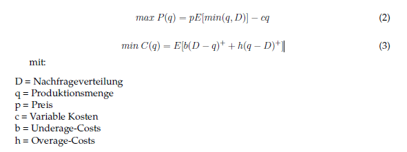
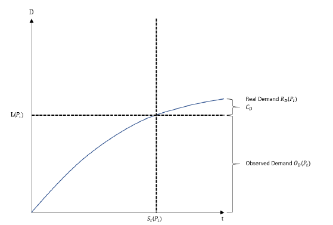
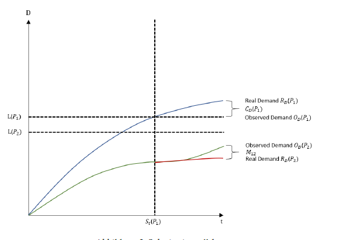
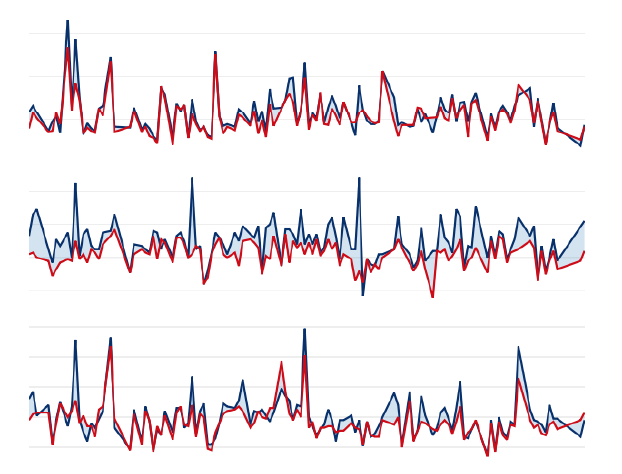
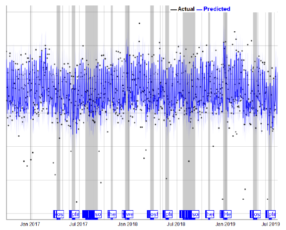
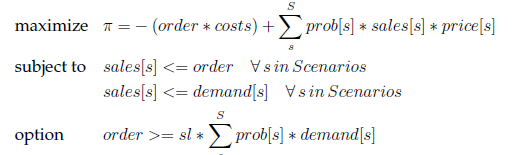
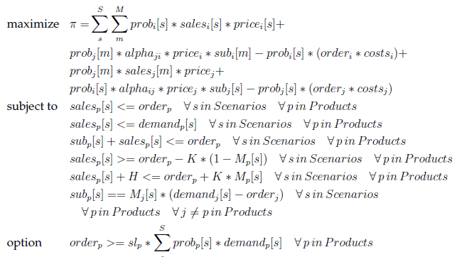

# Advanced Analytics for Operational Planning in Bakeries
In this short blog post I’m writing about the topic of my master thesis which I completed a few years ago. As the thesis is quite long, I want to highlight the most important things but I cannot go into too much details. If you are interested feel free to read through the whole (Master Thesis)[ https://drive.google.com/file/d/1Ac_2wUGZ7chd8ngdvltS2p1KCmm4FGVc/view?usp=sharing]

# Implementation
* [EDA & Forecasting](https://dennis1107.github.io/master_thesis_databakery/)
* [Optimization Model](Optimierungsmodell.ipynb)
* [Shiny Visualization App](app.R)

# Abstract / Summary:
Advanced analytics is hardly used in German bakeries today. While more and more bakeries have been collecting data for several years now, they lack the necessary expertise required to extract the necessary information from it. The decision about a production programme is often made on instinct or with default values. This thesis addresses this problem and shows a holistic approach to creating data-driven production planning. Through the combination of modern forecasting methods and optimisation models, an optimal production quantity is generated. Substitution effects and the problem of censored demand are also taken into account. In a practical context, together with a medium-sized bakery from the Black Forest, the methods are applied and then evaluated.
Problem:
For the thesis I worked together with a local bakery so I was able to analyze real data. A bakery needs to make a decision every day about how much quantity to produce of each product beforehand. This decision also implies that the bakery can only sell as much as previously produced. If there is more demand than previously produced a stockout occurs which results in a lost sale situation. If there is less demand than produced then the leftovers will be discarded.
Therefore the decision is a trade-off between lost sales and too much returns. The problem is similar to the classic Newsvendor Problem.

# Motivation: 
A lot of companies including bakeries still follow the philosophy that the customer is always able to get what he/she wants. In reality that means that there needs to be always too much safety stock so that even if a customer arrives a few minutes before closing he still gets exactly what he wants. This is not sustainable as there is too much food thrown away every day. 
Therefore, I did a survey with customers coming to the bakery. They were asked if they expect to get all products at any time. Furthermore, they were asked if they would buy another product if there first priority is not available anymore. The results were clear. All participants didn’t expect to get their first priority. They would also buy a similar product. Therefore, it is not that important to have each product available at any time rather than have at least one product available in each product group. This implies a certain level of substitution effect between products.

# Problem Description:
The problem described above can be interpreted as the famous Newsvendor Problem (https://en.wikipedia.org/wiki/Newsvendor_model). The Newsvendor Problem takes costs and sales into account in order to achieve an optimal inventory level. 

# Demand Prediction:
One key element here is the demand. To know the future demand by certain is not possible due to the nature of decision making. Therefore, it is necessary to predict the future demand in order to use the Newsvendor formula. 
Before using the sales data to estimate the demand one has to take the censored demand problem into account. Censored Demand can be observed when a specific product is facing a stock out situation. Let’s say brezels were already sold out at 2 pm but the shop closes at 4 pm. The data would show that the demand is equal to the sales data. In reality there might be more demand between 2 and 4 pm but this cannot be observed as the product was already sold out.

With the assumption and the survey results in mind it is known that the demand may shiftet to another product after the stockout. This means that if Product 1 is sold out the customer might choose Product 2. Therefore, the pure sales data of both products are biased to a certain amount. The actual demand of Product 1 is higher than the sales data. For product 2 the demand is actually lower than the sales data shows

With this knowledge we know that the Real Demand differs from the Observed Demand. For each product the original sales data must be corrected. By using the uncensored demand of each product one can built hourly factors of how much demand is made in each hour. With this knowledge it is possible to repair the censored demand data as soon as one product of a product category faced a stockout. The stockout product demand will then be increased while the other products will be decreased due to substitution effects. One correction example can be seen below with the red line being the censored demand and the blue line being the repaired demand.

With the corrected demand data the prediction of the future demand can start. This was done via Machine Learning and Time Series Analysis. I used Facebook Prophet, XGBoost and a Neural Net as models. 

With every prediction there comes also the prediction error / uncertainty which can be used as some kind of forecasting quality. This information is very important for quantifying the optimal production programme as it allows to build stochastic sales scenarios. 

# Optimal Production Programme:
By knowing the future demand and it’s prediction errors the question is still open about how much should be produced. For that an Operations Research Model can be used. By only looking at one single product without substitution the OR Model can be derived easily with the following description. The profit (Turnover – Costs) is maximized under consideration of multiple sales scenarios. The constraints make sure that sales are always smaller than the order or demand. Optional a certain service level can be implemented which means that X% of the demand should be fulfilled. 

Enhancing this model to consider more products (in this case 2) and substitution effects is not trivial. The alpha variable shows the substitution probability between products (0 to 1). This means that target function is enhanced by adding the amount of substitution from product j to product i. This means that the demand of each product can be substituted to a certain level by another product. Secondary conditions 4, 5 and 6 are used to define the correct substitution quantity. These constraints are based on the M-method (Domschke et al. (2015)). In the M method, artificial variables are introduced. In this case, this is the variable M. The variable M ensures that the substitution quantity can only be greater than zero if the respective product is sold out. To ensure this the variables K and H were introduced. The following two examples illustrate how these constraints work. Given a scenario in which a certain product is sold out. Consequently sales = order applies. In this case, according to constraint 4, M can be both 0 and as well as 1. According to constraint 5, M can only take the value 1, since sales + H > than order. Since only M = 1 fulfils both constraints, the substitution assignment is made in constraint 6. In the second example, a certain product is not sold out. Therefore, sales < order. In order for constraint 4 to be fulfilled, M = 0 must be selected. Secondary condition 5 is also fulfilled with M = 0. This results in constraint 6 that the substitution quantity is substitution quantity is 0.

# Results:
It could be shown that using this approach a significant better production programme in comparison to the default programme could be derived. From a scientific approach it was nice to develop this algorithm but it lacks practicality. Due to the design with the sales scenarios of the OR Model it takes very long to run (exponential growth calling). 

